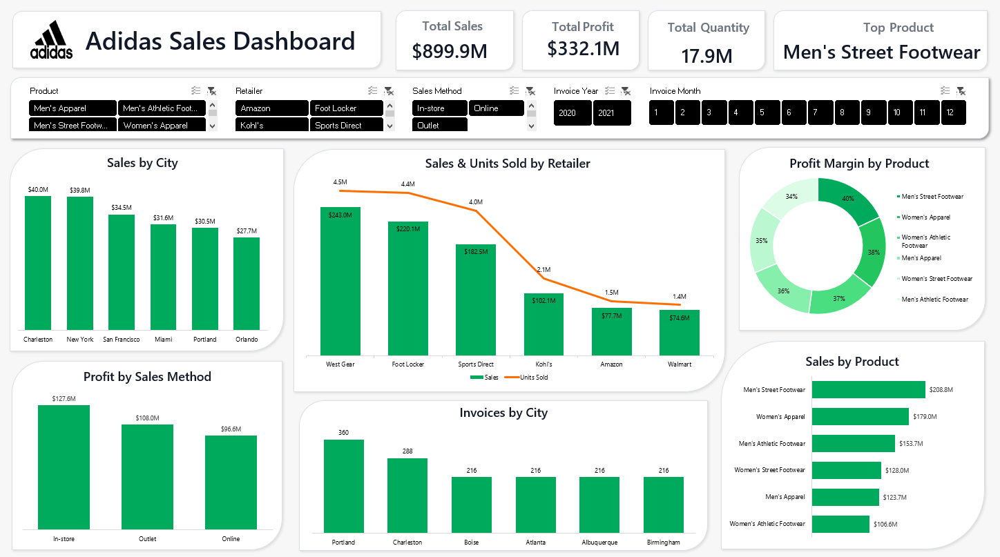

# 👟 Adidas Sales Dashboard

<p align="center">
  
</p>

<p align="center">
Executive Sales Dashboard built with Microsoft Excel 365
</p>

An interactive **Business Intelligence Dashboard** built using **Microsoft Excel 365** to analyze Adidas sales performance across products, retailers, cities, and sales channels. The project leverages **Power Query**, **Pivot Tables**, **Pivot Charts**, **Slicers**, and **Excel formulas** to transform raw sales data into meaningful business insights through a clean, interactive executive dashboard.

---

# 📑 Table of Contents

- Project Overview
- Business Objectives
- Dashboard KPIs
- Dashboard Components
- Dashboard Design Highlights
- Tools & Technologies
- Dataset
- Key Features
- Business Questions Answered
- Key Business Insights
- Skills Demonstrated
- Business Value
- Repository Structure
- How to View the Dashboard
- Future Improvements
- Author

---

# 📌 Project Overview

This project showcases how **Microsoft Excel** can be leveraged as a powerful **Business Intelligence** tool to build an interactive executive dashboard for analyzing Adidas sales performance across products, retailers, sales channels, and geographic locations.

The dashboard combines **Power Query**, **Pivot Tables**, **Pivot Charts**, **Interactive Slicers**, KPI Cards, and modern dashboard design principles to transform raw sales data into actionable business insights that support data-driven decision-making.

---

# 🎯 Business Objectives

- Analyze overall sales performance.
- Monitor key business KPIs.
- Compare retailer performance.
- Evaluate product profitability.
- Analyze sales by city.
- Explore different sales methods.
- Support executive decision-making through interactive reporting.

---

# 📊 Dashboard KPIs

- Total Sales
- Total Profit
- Total Quantity Sold
- Best-Selling Product

---

# 📈 Dashboard Components

## Executive Dashboard

Provides a comprehensive overview of Adidas sales performance through interactive business intelligence reporting.

### Highlights

- Executive KPI Cards
- Interactive Slicers
- Sales by City
- Sales & Units Sold by Retailer (Combo Chart)
- Profit Margin by Product
- Sales by Product
- Profit by Sales Method
- Invoice Analysis
- Dynamic Pivot Charts

---

# 🎨 Dashboard Design Highlights

The dashboard follows modern Microsoft dashboard design principles to provide a clean, professional, and user-friendly reporting experience.

### Design Features

- Executive dashboard layout
- Microsoft-inspired dashboard design
- Professional color palette
- Interactive KPI Cards
- Interactive Slicers
- Rounded dashboard containers
- Consistent typography
- Balanced spacing and alignment
- Clean visual hierarchy
- Business-focused dashboard design
- Optimized dashboard layout
- Improved readability

---

# 🛠️ Tools & Technologies

- Microsoft Excel 365
- Power Query
- Pivot Tables
- Pivot Charts
- Slicers
- Excel Formulas
- Dashboard Design
- Data Visualization
- Business Intelligence Reporting
- Interactive Reporting

---

# 📂 Dataset

The dashboard is built using an Adidas sales dataset containing:

- Invoice Date
- Invoice Year
- Invoice Month
- Retailer
- Sales Method
- Product
- City
- State
- Region
- Units Sold
- Operating Profit
- Operating Margin
- Total Sales

---

# 📊 Key Features

- Executive KPI Cards
- Interactive Dashboard
- Interactive Slicers
- Power Query Data Transformation
- Pivot Tables
- Pivot Charts
- Sales Performance Analysis
- Product Performance Analysis
- Retailer Performance Analysis
- Sales Channel Analysis
- Regional Sales Analysis
- Dynamic Filtering
- Interactive Reporting

---

# ❓ Business Questions Answered

- What are the total sales and profit?
- Which product generates the highest sales?
- Which retailer achieves the highest sales performance?
- Which cities contribute the most revenue?
- How do different sales methods perform?
- Which products have the highest profit margin?
- How are invoices distributed across cities?

---

# 💡 Key Business Insights

- A small number of retailers generate the largest share of total sales.
- Sales performance varies significantly across cities.
- Profit margins differ among product categories.
- Sales methods contribute differently to overall profitability.
- Interactive filtering enables deeper exploration across products, retailers, cities, and sales methods.

---

# 💼 Skills Demonstrated

- Microsoft Excel Dashboard Development
- Power Query Data Transformation
- Business Intelligence Reporting
- Dashboard Design
- KPI Development
- Data Cleaning
- Data Transformation
- Data Analysis
- Data Visualization
- Pivot Tables
- Pivot Charts
- Interactive Slicers
- Dashboard Layout Design
- Business Storytelling
- Interactive Reporting

---

# 💼 Business Value

This dashboard enables stakeholders to:

- Monitor sales performance.
- Analyze profitability.
- Compare retailer performance.
- Evaluate product performance.
- Explore regional sales trends.
- Analyze sales channels.
- Support business decisions through interactive analytics.

---

# 📂 Repository Structure

```text
Adidas-Sales-Dashboard
│
├── README.md
├── Adidas_Sales_Dashboard.xlsx
└── Adidas_Sales_Dashboard.png
```

> **Note:** The dashboard is fully interactive inside the Excel workbook using **Power Query**, **Pivot Tables**, **Pivot Charts**, and **Slicers**.

---

# 🚀 How to View the Dashboard

1. Download or clone this repository.
2. Open **Adidas_Sales_Dashboard.xlsx** using Microsoft Excel 365.
3. Use the interactive slicers to filter the dashboard.
4. Explore the KPI cards and charts to analyze Adidas sales performance.
5. View **Adidas_Sales_Dashboard.png** for a quick dashboard preview.

---

# 🔮 Future Improvements

- Power Pivot Integration
- Automated Dashboard Refresh
- VBA Automation
- Sales Forecasting
- Regional Performance Dashboard
- Migration to Power BI
- Predictive Sales Analytics using Machine Learning

---

# 👤 Author

**Omnia Mohamed**

**Data Analyst**

- 💼 LinkedIn: https://www.linkedin.com/in/omnia26
- 🐙 GitHub: https://github.com/omnia-mohamed26

---

⭐ If you found this project helpful, consider giving it a Star on GitHub!
